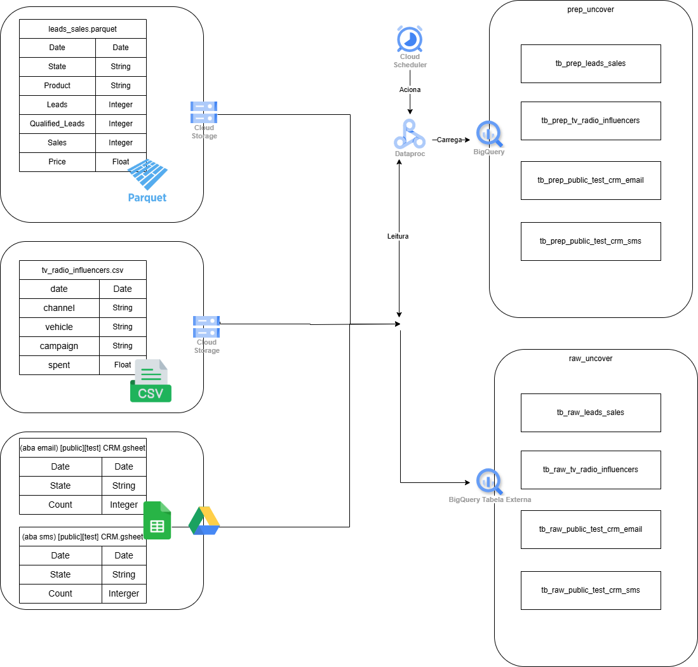

# Case Tecnico Uncover - Usando Terraform Para Criar Pipeline de Dados no GCP

## Visão Geral
Este projeto consiste em centralizar os dados de 3 fontes diferentes em um ambiente de armazenamento que possibilite consultar os dados de maneira simples e seja possivel usa-los como fonte para análises de dados e algoritmos de machine learning.

**Origem dos Dados**
- Uma tabela de banco de dados
- Arquivos CSV
- Planilhas do Google Sheets

## Arquitetura da Solução
Vizando construir uma solução simples e robusta,iremos utilizar os recursos do Google Cloud Platform (GCP). Essa escolha se deve ao fato de que o GCP conta com dezenas de recursos que possibilitam criar um pipeline de dados simples, robusto e escalavel. Todo provisionamento e gerenciamento da infraestrutura no GCP será realizada via Terraform. Integrando o Terraform ao github teremos um projeto com criação de recursos de forma automatizada, versionavel, com redução do trabalho manual e a possibilidade de fazer rollback de versões anteriores do projeto caso necessario.

**Desenho da Solução**


**Principais Componetes**

- Google Cloud Storage (GCS): Para armazenar os arquivos CSV. A inserção de novos arquivos CSV no bucket deverá ser feita via interface do GCP pelo usúario sempre que necessário. Tambem teremos um bucket para armazenar o arquivo parquet que dá origem a uma tabela no Bigquey.
- Google Cloud BigQuery: Usado para o armazenamento centralizado dos dados e realização de consultas SQL nesses dados. Usaremos tambem Tabelas Externas para consultar dados diretamente dos buckets e Google Sheets sem carregá-los inicialmente (camada raw) no armazenamento do Bigquey
- Google Cloud Dataproc: Usado para executar jobs PySpark para extrair, tranformar e carregar os dados no Bigquey.
- Google Cloud Scheduler: Será usado para agendar a execução dos Jobs pelo Dataproc.

**Fluxo de dados**
- Arquivos CSV: 
   - Os arquivos CSV são enviados para um bucket do GCS via interface, sempre que necessário é possivel incluir novos arquivos;
   - Uma tabela Externa do Bigquey é criada baseada nos arquivos contidos no bucket. Essa tabela pertencerá a camada raw do pipeline de dados.
   - O Cloud Scheduler aciona jobs do Dataproc, que usam o PySpark para processar os dados obtidos em uma consulta à Tabela Externa antes de carregá-los no BigQuery.

- Google Sheet: 
   - Os arquivos do Google Sheet são armazenados em um drive terceiro. O arquivo Google Sheet deve estar com a opção de compartilhamento que possibilite qualquer pessoa com o link da planilha realizar leitura;
   - Uma tabela Externa do Bigquey é criada baseada nos arquivos Google Sheet compartilhado. Essa tabela pertencerá a camada raw do pipeline de dados.
   - O Cloud Scheduler aciona jobs do Dataproc, que usam o PySpark para processar os dados obtidos em uma consulta à Tabela Externa baseada no Google Sheet antes de carregá-los no BigQuery.

- Tabela de um Banco de dados: 
   - Os arquivos Parquets contendo dados de uma tabela de banco de dados são enviados para um bucket do GCS via interface, sempre que necessário é possivel incluir novos arquivos;
   - Uma tabela Externa do Bigquey é criada baseada nos arquivos contidos no bucket. Essa tabela pertencerá a camada raw do pipeline de dados.
   - O Cloud Scheduler aciona jobs do Dataproc, que usam o PySpark para processar os dados obtidos em uma consulta à Tabela Externa antes de carregá-los no BigQuery na camada prep que será disponibilizada para conultas.

## Instruções de Configurações
**Pré-requisitos**
- Uma conta no GCP e um projeto configurado com os serviçoes necessários habilitados
- Um bucket no GCP para armazenar o estado das alterações aplicadas no terraform
- Um repositorio no GitHub com workflow terraform configurado.
- Uma conta de serviço do GCP com permissões necessarias para acessar, criar, modificar e excluir os recursos necessários.

**Etapas para Implementação**
  - Criação do workflow do Github: Para criar um worflow, acesse a aba Actions no repositório do Github e pesquise por Terraform. Se você não tiver nem workflow configurado, aparecerá a opção de configurar o Terraform. Ao selecionar a opção Configurar Terraform, aparecerá uma janela com um modelo para integração como esse da imagem a seguir !

- Criação da Conta de Serviço no GCP: Para o GitHub Terraform Workflow interagir com o Google Cloud, é necessário ter uma conta de serviço do Google. Vamos criar uma no painel IAM. Preencha o formulário com um nome de conta de serviço e clique em continuar. Na função de conta de serviço, você deve dar apenas o acesso necessário para os serviços que criará, mas se estiver em execução, dê acesso de Editor.


- Gerar chave JSON para conta de serviço: Na tabela de lista de contas de serviços, acesse a opção Manage Keys na coluna Actions. Depois, crie uma chave JSON para sua Service Account. O navegador pedirá para baixar um arquivo JSON. Baixe-o para usar como uma integração de conta de serviço no GitHub.


- Crie o segredo GOOGLE_CREDENTIALS no GitHub: O próximo passo é usar a chave de credenciais JSON da conta de serviço e criar um segredo chamado GOOGLE_CREDENTIALS no seu projeto GitHub.


- Configurando o Terraform: Para criar arquivos terraform você pode clonar o repositorio em sua maquina através de uma conexão SSH e editar e criar arquivos .tf (arquivos terraform) usando uma IDE como o Vicual Conde. Recomenda-se criar um arquivo tf para cada recurso a ser criado na nuvem. Para este projeto foram criados os seguintes arquivos(para ver as configurações e recursos criada em cada arquivo, visite-os no repositorio):
   - bigquery.tf: Gerenciar recursos do BigQuery.
   - buckets.tf: Gerenciar buckets de armazenamento.
   - dataproc.tf: Gerenciar recursos do Dataproc.
   - main.tf: O arquivo principal de configuração do Terraform, que inclui as definições primárias da infraestrutura e configurações dos recursos
   - scheduler.tf:Gerenciar recursos do Cloud Scheduler.
   - variables.tf: Definir variáveis usadas ao longo das configurações do Terraform. É possivel integrar váriaveis de repositório no projeto GitHUb com fluxo de trabalhos do terraform. Por exemplo, tendo essas variáveis ​​declaradas no projeto GitHub é possível usá-las como valores para variáveis ​​do Terraform. Por padrão, o GitHub Workflow procura um arquivo variables.tf para saber sobre valores para preencher as variáveis. 
   
- Configuração final do Workflow: Tendo a GOOGLE_CREDENTIALS criada e também as variaveis, é hora de usa-los no nosos arquivo workflow.yml. No final ele terá as seguintes configurações:
```ruby
# This workflow installs the latest version of Terraform CLI and configures the Terraform CLI configuration file
# with an API token for Terraform Cloud (app.terraform.io). On pull request events, this workflow will run
# `terraform init`, `terraform fmt`, and `terraform plan` (speculative plan via Terraform Cloud). On push events
# to the "main" branch, `terraform apply` will be executed.
#
# Documentation for `hashicorp/setup-terraform` is located here: https://github.com/hashicorp/setup-terraform
#
# To use this workflow, you will need to complete the following setup steps.
#
# 1. Create a `main.tf` file in the root of this repository with the `remote` backend and one or more resources defined.
#   Example `main.tf`:
#     # The configuration for the `remote` backend.
#     terraform {
#       backend "remote" {
#         # The name of your Terraform Cloud organization.
#         organization = "example-organization"
#
#         # The name of the Terraform Cloud workspace to store Terraform state files in.
#         workspaces {
#           name = "example-workspace"
#         }
#       }
#     }
#
#     # An example resource that does nothing.
#     resource "null_resource" "example" {
#       triggers = {
#         value = "A example resource that does nothing!"
#       }
#     }
#
#
# 2. Generate a Terraform Cloud user API token and store it as a GitHub secret (e.g. TF_API_TOKEN) on this repository.
#   Documentation:
#     - https://www.terraform.io/docs/cloud/users-teams-organizations/api-tokens.html
#     - https://help.github.com/en/actions/configuring-and-managing-workflows/creating-and-storing-encrypted-secrets
#
# 3. Reference the GitHub secret in step using the `hashicorp/setup-terraform` GitHub Action.
#   Example:
#     - name: Setup Terraform
#       uses: hashicorp/setup-terraform@v1
#       with:
#         cli_config_credentials_token: ${{ secrets.TF_API_TOKEN }}

name: 'Terraform'

on:
  push:
    branches: [ "main" ]
  pull_request:

permissions:
  contents: read

jobs:
  terraform:
    name: 'Terraform'
    runs-on: ubuntu-latest
    environment: production

    # Use the Bash shell regardless whether the GitHub Actions runner is ubuntu-latest, macos-latest, or windows-latest
    defaults:
      run:
        shell: bash
        #Inform a working directory if .tf files are not in root folder
        #working-directory: ./terraform 

    steps:
    # Checkout the repository to the GitHub Actions runner
    - name: Checkout
      uses: actions/checkout@v4

    # Install the latest version of Terraform CLI and configure the Terraform CLI configuration file with a Terraform Cloud user API token
    - name: Setup Terraform
      uses: hashicorp/setup-terraform@v1
      #with:
      #  cli_config_credentials_token: ${{ secrets.TF_API_TOKEN }}

    - name: Setup terraform variables
      id: vars
      run: |-
        cat > pipeline.auto.tfvars <<EOF
        region="${{ vars.GCP_REGION }}" 
        project="${{ vars.GCP_PROJECT }}" 
        data-project="${{ vars.GCP_DATA_PROJECT }}"
        bk_csv="${{ vars.BK_CSV }}"
        bk_parquet="${{ vars.BK_PARQUET}}"
        EOF

    # Initialize a new or existing Terraform working directory by creating initial files, loading any remote state, downloading modules, etc.
    - name: Terraform Init
      run: terraform init
      env:
        GOOGLE_CREDENTIALS: ${{ secrets.GOOGLE_CREDENTIALS }}

    # Checks that all Terraform configuration files adhere to a canonical format
    #- name: Terraform Format
    #  run: terraform fmt -check

    # Generates an execution plan for Terraform
    - name: Terraform Plan
      run: terraform plan -input=false
      env:
        GOOGLE_CREDENTIALS: ${{ secrets.GOOGLE_CREDENTIALS }}

      # On push to "main", build or change infrastructure according to Terraform configuration files
      # Note: It is recommended to set up a required "strict" status check in your repository for "Terraform Cloud". See the documentation on "strict" required status checks for more information: https://help.github.com/en/github/administering-a-repository/types-of-required-status-checks
    - name: Terraform Apply
      if: github.ref == 'refs/heads/main' && github.event_name == 'push'
      run: terraform apply -auto-approve -input=false
      env:
        GOOGLE_CREDENTIALS: ${{ secrets.GOOGLE_CREDENTIALS }}
```

Após criar todos os recursos e configurações nos arquivos Terraform, faça os push no github e observe os recusrso sendo criado no GCP. Use os seguintes comandos:
```
git add .
git commit -m "Comentario desejado"
git push
```
Observe as actions criadas no git hub: 
. 
Caso a action fique verde é sinal de que foi executado a criação/alteração dos recursos, e pode-se observar-los no GCP.
